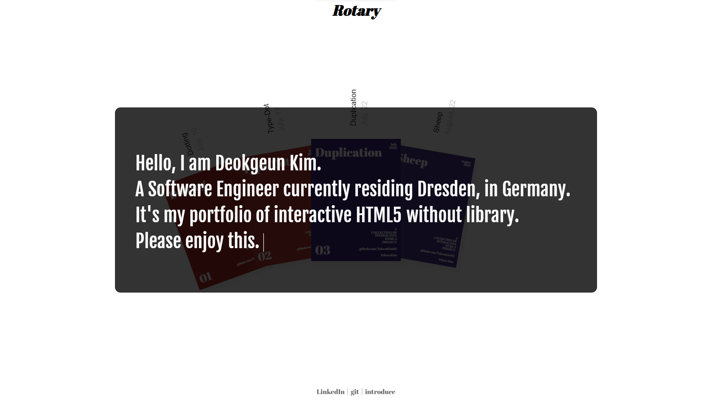
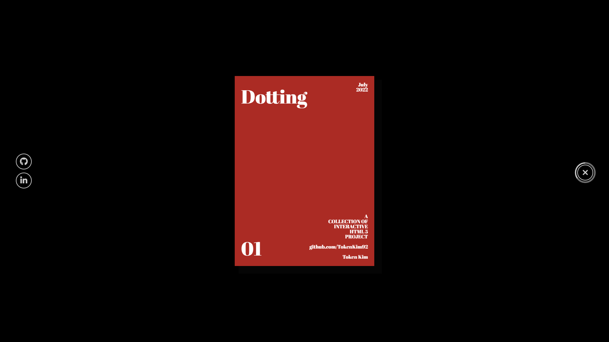
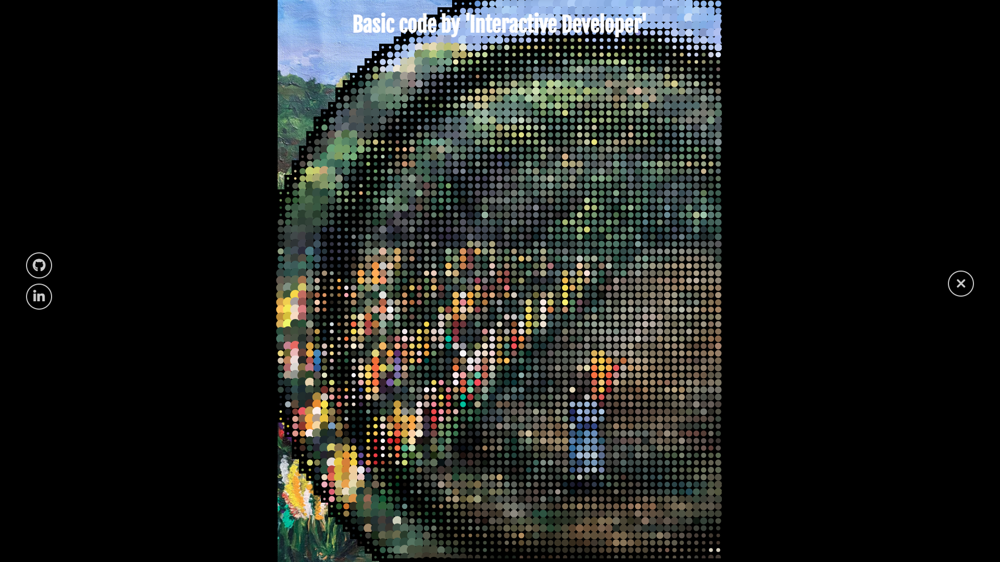

# Rotary

This project was implemented to show how a single page application (SPA) works with animation effects in HTML5. I use all my HTML5 projects as cover for each portfolio.

Click on a portfolio cover to view the project directly on the same page.

This project was inspired by YouTuber `Interactive Developer`, but all architecture and code was implemented by me.

This video is under this link: https://youtu.be/cpEeqACsF_Q

## Included library projects

- <a href="https://github.com/TokenKim92/Typing" target="blank">
    Typing
  </a>: to introduce myself and this portfolio
- <a href="https://github.com/TokenKim92/Dotting" target="blank">
    Dotting
  </a>: as a portfolio cover
- <a href="https://github.com/TokenKim92/TypographyDot" target="blank">
      TypographyDot
    </a>: as a portfolio cover
- <a href="https://github.com/TokenKim92/Duplication" target="blank">
     Duplication
   </a> : as a portfolio cover
- <a href="https://github.com/TokenKim92/Sheep" target="blank">
    Sheep
  </a>: as a portfolio cover

## Used tools

- HTML5
- CSS3
- JavaScript

## Overview

  
  
  

## Page

https://tokenkim92.github.io/Rotary/
